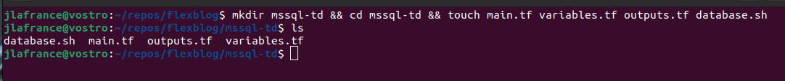
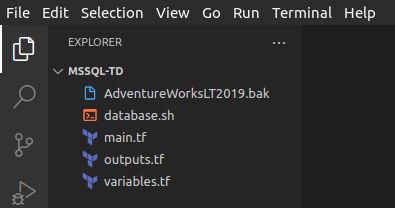
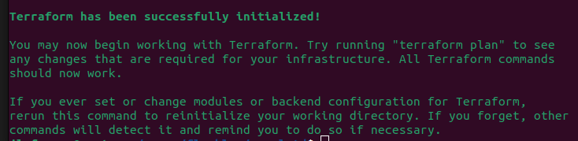
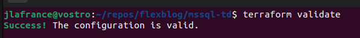
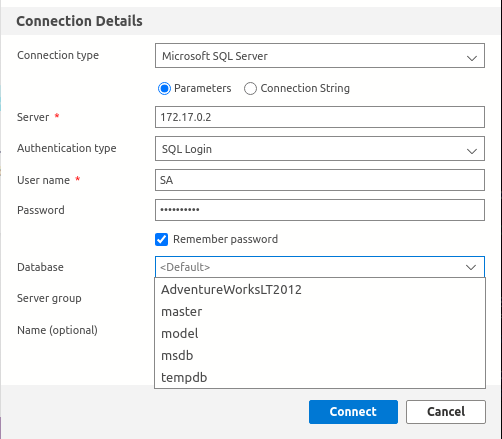

# SQL Server database using Terraform & Docker locally Ubuntu 22.04
__Auther:__ [jldroid19](https://github.com/jldroid19)


This post we will be building a Docker container running SQL Server using Terraform as our provisioner.

__Source code:__ [https://github.com/jldroid19/mssql-td](https://github.com/jldroid19/mssql-td)

### Required OS and Software
1. __Ubuntu 22.04__ (This may work on Ubuntu 20.04 as well, no gurantees)
2. __Docker engine:__ [https://docs.docker.com/engine/install/ubuntu/](https://docs.docker.com/engine/install/ubuntu/)
3. __Terraform:__ [https://developer.hashicorp.com/terraform/tutorials/aws-get-started/install-cli](https://developer.hashicorp.com/terraform/tutorials/aws-get-started/install-cli)
4. (Optional) __Azure Data Studio:__ [https://learn.microsoft.com/en-us/sql/azure-data-studio/download-azure-data-studio?view=sql-server-ver16](https://learn.microsoft.com/en-us/sql/azure-data-studio/download-azure-data-studio?view=sql-server-ver16)

### Needed files
A copy of the __AdventureWorksLT2019.bak__ which can be retrieved from here: [https://learn.microsoft.com/en-us/sql/samples/adventureworks-install-configure?view=sql-server-ver16&tabs=ssms](https://learn.microsoft.com/en-us/sql/samples/adventureworks-install-configure?view=sql-server-ver16&tabs=ssms)

Okay let's go ahead and start mapping out our file structure.

*************************************************************

Open a terminal and create the folder and files needed.



- __main.tf__ (define the provider and resources)
- __variables.tf__ (set variables that will be used to describe the container)
- __outputs.tf__ (tailor some container information to print to the terminal.
- __database.sh__ (bash script used to provision the container with the AdventureWorks database)

2. Now go ahead and open up the mssql-td directory with your preferred code editor. You should have something similar to the image below.



3. Let's go ahead and start with our __main.tf__ configuration.

__mssql-td/main.tf__
```
terraform {
  required_providers {
    docker = {
      source  = "kreuzwerker/docker"
      version = "~> 2.13.0"
    }
  }
}

provider "docker" {}

resource "docker_image" "mssql" {
  name         = "mcr.microsoft.com/mssql/server:2019-latest"
  keep_locally = true
}

resource "docker_container" "mssql" {
  image = docker_image.mssql.name
  name  = var.container_name
  env = ["ACCEPT_EULA=Y", "MSSQL_SA_PASSWORD=Password1!"]

  provisioner "local-exec" {
    command = "sh ./database.sh"
  }
}
```

4. Quick overview of the __main.tf__ file
- __required_providers__ - (this is the porvider we will be using to allow Terraform to communicate with docker engines api.)
- __provider__ - (telling Terraform that we will be using docker to build this database.)
- __resource "docker_image"__ - (Defining which image we will be pulling down from docker hub, and telling terraform to keep the image locally even after a terraform destroy.)
- __resource "docker_container"__ - (telling Terraform to use the above image resource for our container, the name of the container which we'll declare as a variable in out variables.tf file. The env value is very important because it accepts the EULA and sets our database password right away. Keepign the password in plain text like this is not recommended for production use.). Now the last bit is the provisioner. Thi is the most important peice of what we're doing. This will call on the database.sh script which has commands that will be executed inside out container during the terraform apply.

5. Now let's set our containers 'name' variable. Below is what we want our variables.tf to look like.

__mssql-td/variables.tf__

```
variable "container_name" {
  description = "MSSQL database, Docker container"
  type        = string
  default     = "mssql"
}
```

6. Let's talk about what we have written above.
- We declared a variable called __"container_name"__ which looks familiar to what is in our __main.tf__.

- In our __"container_name"__ variable block we defined what that variable consists of.
- __description__ - A short description of what this container is or what           purpose it serves.
- __type__ - string (We want this variable to be of string type)
- __default__ - The name of our container

7. Now let's configure our __outputs.tf__ file. This will give us a place to tailor any output we want about the container to the terminal after we terraform apply. Go ahead and place the below blocks in your outputs.tf file.

__mssql-td/outputs.tf__
```
output "container_id" {
  description = "ID of the Docker container"
  value       = docker_container.mssql.id
}

output "image_id" {
  description = "ID of the Docker image"
  value       = docker_image.mssql.id
}
```

8. Quick overview of the outputs.tf file
- __"container_id"__ (Gets the container id and prints it to the terminal)
- __"image_id"__ (Gets the image the container is using and prints it to the terminal.)

9. Now the final piece to the puzzle is the database.sh script. Place the below in your database.sh file.

__mssql-td/database.sh__
```
#!/bin/bash

echo "Let's configure this container!"
uname=SA
pwrd=Password1!
bakitup=AdventureWorksLT2019.bak

echo "Creating backup directory"
docker exec -i mssql mkdir /var/opt/mssql/backup

echo "Copying .bak to container"
docker cp AdventureWorksLT2019.bak mssql:/var/opt/mssql/backup

echo "LOADING DATABASE LOGICAL FILES"
docker exec -i mssql /opt/mssql-tools/bin/sqlcmd -S localhost -U $uname -P $pwrd -Q 'RESTORE FILELISTONLY FROM DISK = "/var/opt/mssql/backup/'$bakitup'"' | tr -s ' ' | cut -d ' ' -f 1-2

echo "RESTORING DATABASE"
docker exec -i mssql /opt/mssql-tools/bin/sqlcmd -S localhost -U $uname -P $pwrd -Q 'RESTORE DATABASE AdventureWorksLT2012 FROM DISK = "/var/opt/mssql/backup/'$bakitup'" WITH MOVE "AdventureWorksLT2012_data" TO "/var/opt/mssql/data/AdventureWorksLT2019.mdf", MOVE "AdventureWorksLT2012_Log" TO "/var/opt/mssql/data/AdventureWorksLT2012_log.ldf"'

echo "DATABASE CONNECTION INFORMATION"
echo "Container IP: "
docker inspect -f '{{range .NetworkSettings.Networks}}{{.IPAddress}}{{end}}' mssql
echo "Username: " $uname
echo "Password: " $pwrd
```

10. Quick overview of the __database.sh__ script
- __mkdir__ in the container for the AdventureWorksLT2019.bak file to live
- __cp__ the AdventureWorksLT2019.bak file into the container
- __exec__ the restore of the logical files needed for the full database restore to occur.
- __exec__ the restore of the whole database.

__Note:__ if you are using a different database you'll need to change the database name and logical file names.

11. Okay I think we are in a good spot to build this container using terraform.

12. Open a terminal and let's start building this thing.
- Let's initialize the Terraform project using: ```terraform init```

- Now let's cleanup our file formats with: terraform fmt
(If no output is present then that means your formatting is good to          go.
- Let's validate our configuration with: ```terraform validate```

- Let's execute plan to see what were lookign at: ```terraform plan```

```
Terraform used the selected providers to generate the following execution plan. Resource actions are indicated with the following
symbols:
  + create

Terraform will perform the following actions:

  # docker_container.mssql will be created
  + resource "docker_container" "mssql" {
      + attach           = false
      + bridge           = (known after apply)
      + command          = (known after apply)
      + container_logs   = (known after apply)
      + entrypoint       = (known after apply)
      + env              = [
          + "ACCEPT_EULA=Y",
          + "MSSQL_SA_PASSWORD=Password1!",
        ]
      + exit_code        = (known after apply)
      + gateway          = (known after apply)
      + hostname         = (known after apply)
      + id               = (known after apply)
      + image            = "mcr.microsoft.com/mssql/server:2019-latest"
      + init             = (known after apply)
      + ip_address       = (known after apply)
      + ip_prefix_length = (known after apply)
      + ipc_mode         = (known after apply)
      + log_driver       = "json-file"
      + logs             = false
      + must_run         = true
      + name             = "mssql"
      + network_data     = (known after apply)
      + read_only        = false
      + remove_volumes   = true
      + restart          = "no"
      + rm               = false
      + security_opts    = (known after apply)
      + shm_size         = (known after apply)
      + start            = true
      + stdin_open       = false
      + tty              = false

      + healthcheck {
          + interval     = (known after apply)
          + retries      = (known after apply)
          + start_period = (known after apply)
          + test         = (known after apply)
          + timeout      = (known after apply)
        }

      + labels {
          + label = (known after apply)
          + value = (known after apply)
        }
    }

  # docker_image.mssql will be created
  + resource "docker_image" "mssql" {
      + id           = (known after apply)
      + keep_locally = true
      + latest       = (known after apply)
      + name         = "mcr.microsoft.com/mssql/server:2019-latest"
      + output       = (known after apply)
      + repo_digest  = (known after apply)
    }

Plan: 2 to add, 0 to change, 0 to destroy.

Changes to Outputs:
  + container_id = (known after apply)
  + image_id     = (known after apply)
```

- Okay I think everthing checks out. Let's apply it: terraform apply
Enter a value: yes

__Note:__ If you get an error make sure your database.sh script is            executable (chmod +x database.sh)


13. The container has been successfully built and the AdventureWorks database has been restored. 

__Note:__ the Container IP and Username/Password. Let's go ahead and launch Azure Data Studio to see if we can connect to this new container.

14. Click __'New'__ then __'new connection'__. Fill in the connection info, then click __'Connect'__.


15. Select __'Databases'__ and you'll see the __AdventureWorksLT2012__ database available for use.

16. Clean up when done: terraform destroy

__Conclusion__

This terraform - docker configuration should not be used for production. This is purely a way to quickly restore past backup databases into a container. Allowing you to interact with actual operational data at a very low cost. I found this especially useful when developing applications geared towards data analysis. Just remember once you execute terraform destroy this database and any changes you have made to it will be gone. Great for quick database structure access without exposing your cloud development/production environments to developers. Also, it's super free!!!!!!!

